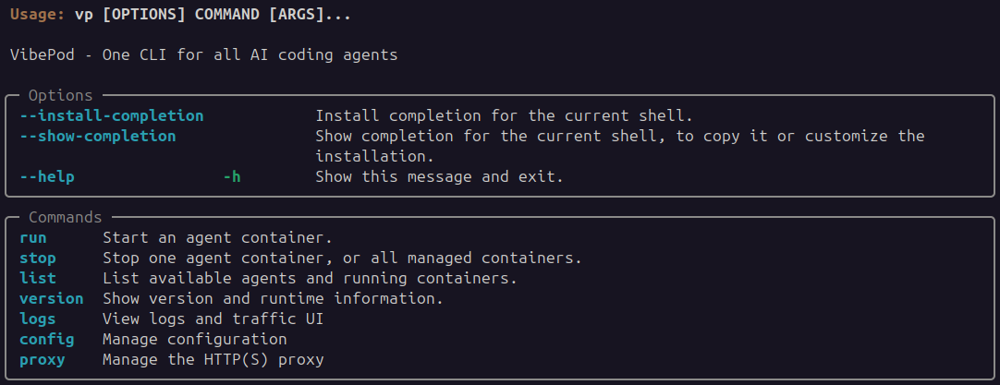
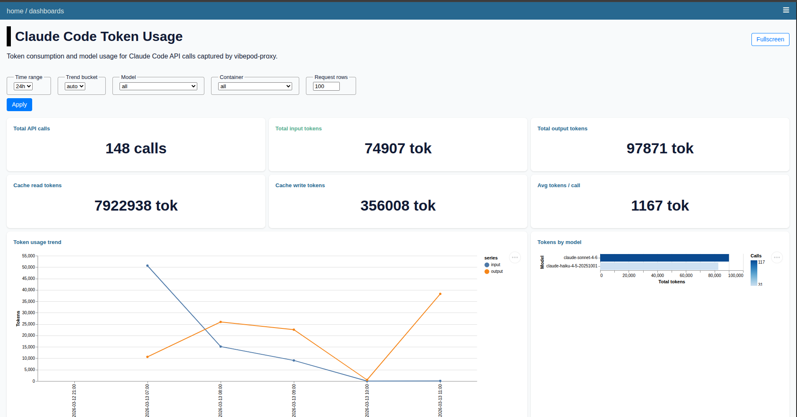

# VibePod

[](https://vibepod.dev/docs/)
[](https://pypi.org/project/vibepod/)
[](https://github.com/VibePod/vibepod-cli/actions/workflows/ci.yml)
[](https://github.com/VibePod/vibepod-cli/actions/workflows/docs.yml)


VibePod is a unified CLI (`vp`) for running AI coding agents in isolated
Docker containers — no required configuration, no setup. Just
`vp run <agent>`. Includes built-in local metrics collection, HTTP traffic
tracking, and an analytics dashboard to monitor and compare agents side-by-side.

## Features

- ⚡ **Zero config** — no setup required; `vp run <agent>` just works. Optional YAML for custom configuration
- 🐳 **Isolated agents** — each agent runs in its own Docker container
- 🔀 **Unified interface** — one CLI for Claude, Gemini, Codex, Devstral, Copilot, Auggie & more
- 📊 **Local analytics dashboard** — track usage and HTTP traffic per agent, plus token metrics
- ⚖️ **Agent comparison** — benchmark multiple agents against each other in the dashboard
- 🔒 **Privacy-first** — all metrics collected and stored locally, never sent to the cloud
- 📦 **Simple install** — `pip install vibepod`

## Installation

VibePod is available on [PyPI](https://pypi.org/project/vibepod/):

```bash
pip install vibepod
```

## Quick Start

```bash
vp run <agent>
# examples:
vp run claude
vp run codex
```



## Current Status

This repository contains an initial v1 implementation with:

- `vp run <agent>`
- `vp stop <agent|--all>`
- `vp list`
- `vp config init`
- `vp config show`
- `vp config path`
- `vp version`

## Analytics & Dashboard

VibePod collects metrics locally while your agents run and serves them through
a built-in dashboard.



| Command          | Description                                        |
|------------------|----------------------------------------------------|
| `vp logs start`  | Start or resume dashboard for collected metrics     |
| `vp logs stop`   | Stop the dashboard container                       |
| `vp logs status` | Show dashboard container status                    |

The dashboard shows per-agent HTTP traffic, usage over time, and Claude token
metrics. It also lets you compare agents side-by-side. All data stays on your
machine.

## Image Namespace

All agent images are published under the [`vibepod` namespace on Docker Hub](https://hub.docker.com/u/vibepod). Source Dockerfiles are in [VibePod/vibepod-agents](https://github.com/VibePod/vibepod-agents/tree/main/docker).

Current defaults:

- `claude` -> `vibepod/claude:latest`
- `gemini` -> `vibepod/gemini:latest`
- `opencode` -> `vibepod/opencode:latest`
- `devstral` -> `vibepod/devstral:latest`
- `auggie` -> `vibepod/auggie:latest`
- `copilot` -> `vibepod/copilot:latest`
- `codex` -> `vibepod/codex:latest`
- `datasette` -> `vibepod/datasette:latest`
- `proxy` -> `vibepod/proxy:latest` ([repo](https://github.com/VibePod/vibepod-proxy))

## Overriding Images

You can override any single image directly:

```bash
VP_IMAGE_CLAUDE=vibepod/claude:latest vp run claude
VP_IMAGE_GEMINI=vibepod/gemini:latest vp run gemini
VP_IMAGE_OPENCODE=vibepod/opencode:latest vp run opencode
VP_IMAGE_DEVSTRAL=vibepod/devstral:latest vp run devstral
VP_IMAGE_AUGGIE=vibepod/auggie:latest vp run auggie
VP_IMAGE_COPILOT=vibepod/copilot:latest vp run copilot
VP_IMAGE_CODEX=vibepod/codex:latest vp run codex
VP_DATASETTE_IMAGE=vibepod/datasette:latest vp logs start
```

## License

MIT License - see [LICENSE](LICENSE) for details.
